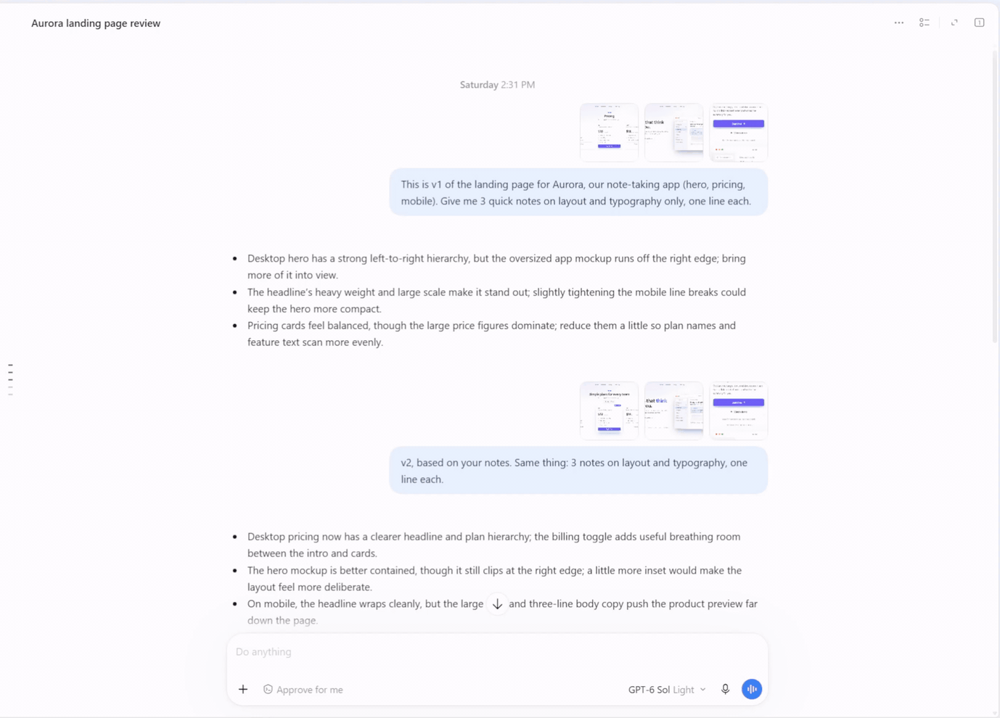

<p align="center">
  
</p>

<h1 align="center">Codex Attachment Manager</h1>

<p align="center">不换任务，决定哪些历史图片随下一条消息发给模型。</p>

<p align="center">
  <a href="https://github.com/chipfighter/codex-attachment-manager/actions/workflows/ci.yml"></a>
  <a href="https://github.com/chipfighter/codex-attachment-manager/releases"></a>
  
  
  <a href="LICENSE"></a>
</p>

<p align="center"><a href="README.md">English</a> · <b>简体中文</b></p>

<p align="center">
  
</p>

在 Codex 的长任务里，你上传的、模型查看或生成的每张图，之后每次请求都会重新发给模型，请求越来越大。把不再需要的图取消勾选：从下一条消息起它们就不再发送，任务不换，对话连续。

## 功能

- **所有图片一个列表**：Codex 右侧的侧边面板里多出一个“上下文素材”标签页，按轮次列出任务里的每张图，包括你上传的，以及模型查看、生成的，带缩略图、编号和大小，点开可以看大图。
- **点一下就不再发送**：取消勾选的图，从下一条消息起换成一小段占位文字。可以单张勾选，也可以整轮勾选。
- **重复的图自动处理**：有内容相同的图还在发送时，占位文字指向那一张。
- **模型知道原因**：一段说明告诉模型，这些图是你为了节省上下文省略的。它之前看着原图给出的回答仍然算数，也不会编造看不到的细节。
- **模型要图，你来决定**：模型需要某张图时，会回复“需要 IMG-xxx”。面板列出它要的图，点一下就跳过去。重新勾上的图回到对话里原来的位置，并标着编号。
- **看得见省了多少**：面板预估下一条请求的大小，以及比全部发送省了多少；请求没能改写时会提示。
- **中英文界面**：面板、标签页名字和给模型的说明，都跟随 Codex 的界面语言（简体中文、英文）。
- **数据留在本机**：除了 Codex 本来就要发给 OpenAI 的请求，插件不向任何地方发送数据。

## 工作原理

- 插件在本机启动一个小代理（引擎），位于 Codex 和 OpenAI 之间。请求发出前，引擎把取消勾选的图换成占位文字，并加上那段说明；其余内容原样转发。
- 勾选状态按任务分别保存，只有你能改，模型不能。
- 面板是一个 MCP 应用，从侧边面板打开，不经过模型，也不花 token。

## 环境要求

- Codex 桌面版。在 Windows 上用 Codex 26.924 实测过。
- macOS、Linux：CI 会用 Codex 自己的命令行装上插件、启动插件，并跑一遍安装和卸载脚本；但还没有人在这两个平台的桌面版上实际用过。遇到问题欢迎[提 issue](https://github.com/chipfighter/codex-attachment-manager/issues)。
- 不用另装 Node：插件使用 Codex 自带的 Node 24；找不到时，才用 PATH 里 24 及以上版本的 `node`。

## 安装

### 在 Codex 里安装，不用开终端

1. 在 Codex 的**插件**页面点**添加插件市场**，**来源**填 `chipfighter/codex-attachment-manager`，其余留空，点**添加市场**。
2. 在列表里找到 **Codex Attachment Manager**，安装。
3. 打开一个任务，点右上角的**显示/隐藏侧边面板**，用 **+** 新建一个标签页，在**插件和 MCP**下选**上下文素材**。找不到的话，先重启一次 Codex。
4. 面板提示插件还没有启用。点**启用插件**，然后重启 Codex。

### 一行命令

Windows（PowerShell）：

```powershell
irm https://github.com/chipfighter/codex-attachment-manager/releases/latest/download/install.ps1 | iex
```

macOS、Linux：

```bash
curl -fsSL https://github.com/chipfighter/codex-attachment-manager/releases/latest/download/install.sh | sh
```

命令会用 Codex 自己的命令行装好插件，并写好代理设置。装完重启 Codex。以后再运行一次，就是升级到最新版本。

### 安装会改什么

- 在 `~/.codex/config.toml` 里写一段带标记的代理设置，改之前先备份。
- 如果环境变量里设了代理，再在 `~/.codex/.env` 里写一段带标记的 `NO_PROXY`，只包含本机地址。
- 别的一概不动。如果你自己设了 `openai_base_url`，安装会停下来，什么都不写。

## 使用

1. 在任务的侧边面板里打开**上下文素材**。新任务也可以在发第一条消息之前打开：发出消息后，面板会自动切到这个任务。
2. 取消勾选不想再发送的图。每次改动立刻保存，从下一条消息起生效。
3. 模型回复“需要 IMG-xxx”、而那张图没有勾上时，面板顶部会列出它。点编号跳到那张图，勾上即可。

## 卸载

先停用，再移除：在面板里点**停用插件**，在**插件**页面移除插件，然后重启 Codex。

也可以运行卸载命令。它会恢复直连并移除插件，插件文件已经删掉时也能用：

Windows（PowerShell）：

```powershell
irm https://github.com/chipfighter/codex-attachment-manager/releases/latest/download/uninstall.ps1 | iex
```

macOS、Linux：

```bash
curl -fsSL https://github.com/chipfighter/codex-attachment-manager/releases/latest/download/uninstall.sh | sh
```

勾选记录和日志留在数据目录里（见[隐私](#隐私)），不需要可以删掉。

**Codex 连不上时**：如果 Codex 的报错里带着 `localhost:17891`（比如没先停用就移除了插件），运行上面的卸载命令，再重启 Codex。macOS、Linux 上，插件被移除或关掉后，引擎也会自己恢复直连，下次启动 Codex 时生效。

## 一点补充

- 目前只管理图片，其他类型的文件以后再支持。
- Codex 自带生图工具的结果不能取消。
- 取消勾选时，如果这一轮还在进行，并且走的是 WebSocket，这一轮剩下的请求仍会带着原图。面板会提示，从下一条消息起生效。
- 启用、停用和升级，都要重启 Codex 才生效。
- 切换 Codex 的界面语言后，面板立刻跟着换，给模型的说明从下一条消息起换；侧边面板里标签页的名字要重启 Codex 才换。
- Codex 刚启动时，引擎可能会重启几次，偶尔会看到一次“正在重新连接”。
- 引擎沿用系统代理：Windows 读系统设置；macOS 只支持 HTTP(S) 代理，不支持 PAC 和 SOCKS；Linux 读 `HTTPS_PROXY` 等环境变量。

## 隐私

- 所有数据只留在本机的数据目录：Windows 是 `%USERPROFILE%\.codex-attachment-manager`，macOS 是 `~/Library/Application Support/codex-attachment-manager`，Linux 是 `~/.local/share/codex-attachment-manager`。里面有勾选记录、请求统计（只记大小和数量，不记内容）、日志（不记对话内容和凭据），以及 `config.toml` 的备份。
- 除了 Codex 本来就要发给 OpenAI 的请求，插件不向任何地方发送数据。
- Codex 的原始对话记录只读，不修改。

## 开发

- `plugin/` 是插件本体：MCP 服务、引擎、面板和 `cam` 命令行，运行代码在 `plugin/src`。`spike/` 是测试和实验脚本，`scripts/` 是一行命令用的安装、卸载脚本，`docs/` 是规格和技术方案，从 [docs/spec.md](docs/spec.md) 读起；v0.1 的开发记录在 `docs/history/v0.1/`。
- 从源码装进自己的 Codex：先退出 Codex，在仓库里运行 `cam install`（macOS、Linux 上是 `./cam install`），再启动 Codex。`cam status` 查看安装状态，`cam uninstall` 卸载。
- 运行测试（需要 Node 24 及以上）：`cd spike && node --test`。CI 在 Windows、macOS、Linux 上跑全部单元测试，再用 Codex 的命令行装一遍插件，跑一遍安装和卸载脚本。
- 不开 Codex 调面板：运行 `node spike/scripts/panel-dev.ts`，然后打开 `http://127.0.0.1:17895/?solo=1`。页面用合成的测试图和一个临时的 Codex 目录，不读取、不修改你的真实数据。
- 改了发给模型的文字（`plugin/src/rewrite.ts`）后，要跑 `spike/src/v01-placeholder-selftest.ts` 和 `spike/src/v01-needs-selftest.ts` 两个自测，中文、英文（`--lang en`）各一次。它们会自己启动引擎和 app-server，使用你的 Codex 账号，测完把建的测试任务归档。
- 更新记录见 [CHANGELOG.md](CHANGELOG.md)。

## 许可证

[MIT](LICENSE)
